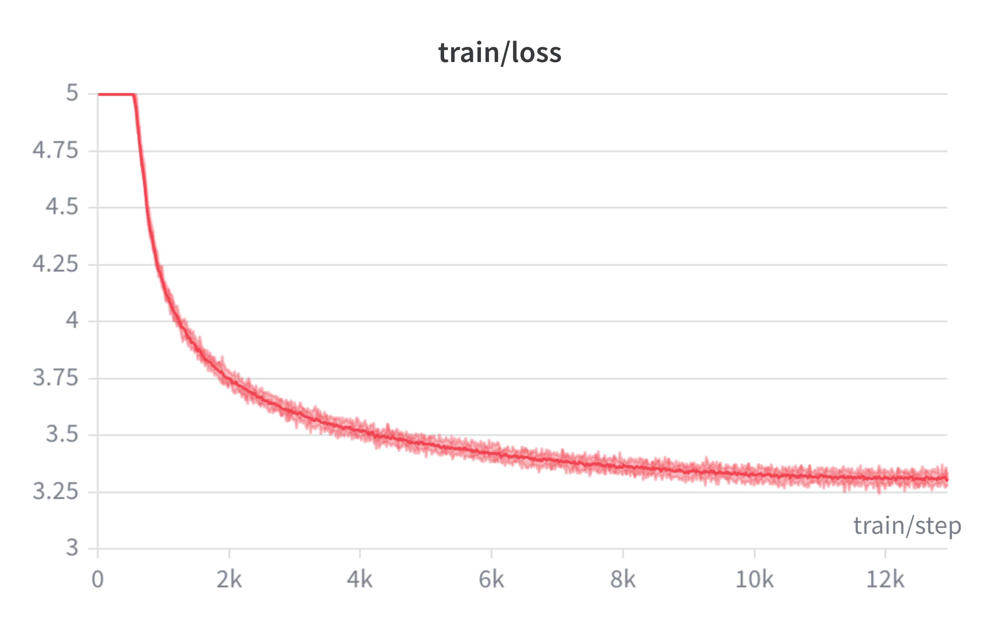
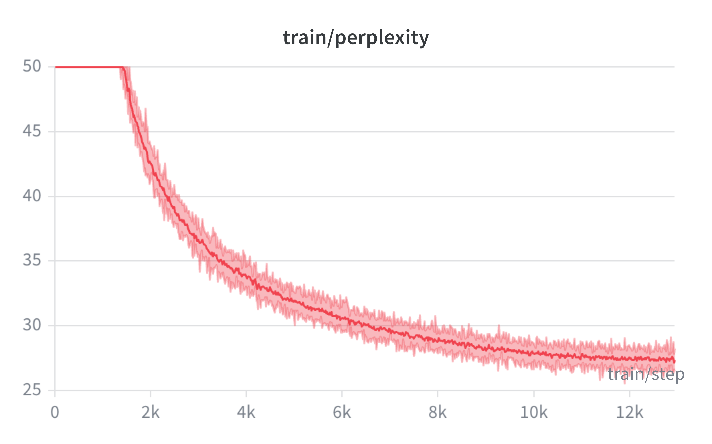
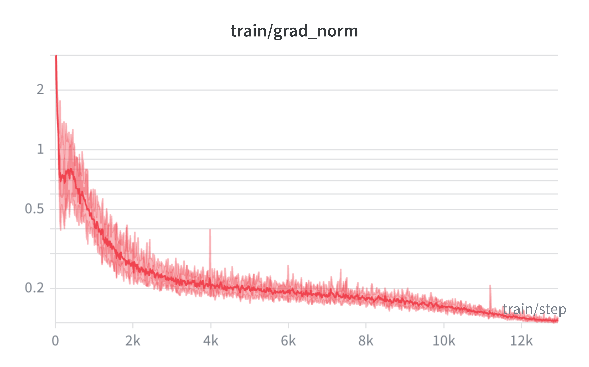
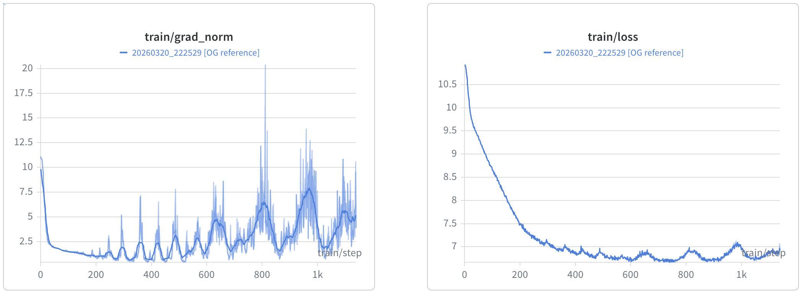

## GPT-2 from Scratch — The Paper‑Only Journey

### Description
To learn LLM pre-training, I attempted to implement GPT2 from scratch by referring only to the GPT1 and GPT2 papers. This work deliberately avoided implementation videos, blogs and tutorials to expose the kind of mistakes, hidden assumptions, naive ablation and training stability issues that only surface while translating research papers into a working code.

### Training Summary

| Key                          | Value                   |
|---------------------------------|-------------------------|
| Parameters                      | 124M                    |
| Layers                          | 12                      |
| Context Length                  | 1024                    |
| Dataset                         | [openwebtext dataset](https://huggingface.co/datasets/Skylion007/openwebtext) |
| Trained Tokens                  | 6.7B                    |
| Hardware                        | [NVIDIA DGX Spark - GB10](https://www.nvidia.com/en-in/products/workstations/dgx-spark/) |
| Global Batch Size               | 512                     |
| Avg. Training Throughput        | 31000 tokens/sec        |
| Validation Loss                  | 3.3                     |
| Validation Perplexity     | 28                      |
| Training Time                   | 60 Hours                |
| Precision                       | BF16                    |
| MFU - Model FLOPs Utilization   | 38%                     |

- Theoretical max for dense tensor in BF16 is `62 TFLOPs` for GB10 chip

### Performance Optimizations

These optimizations improved training time from expected 280 Hours to 60 Hours.
- FlashAttention / SDPA kernels
- `is_causal=True`
- `torch.compile()`
- `torch.set_float32_matmul_precision('high')`
- Disabled attention weight materialization

### WandB experiment details
- stable run link - https://wandb.ai/ashutosh26/gpt2-from-scratch/runs/pvl5y7b8
<table>
  <tr>
    <td width="33.33%"></td>
    <td width="33.33%"></td>
    <td width="33.33%"></td>
  </tr>
</table>


- same domain [validation](https://wandb.ai/ashutosh26/gpt2-from-scratch/runs/kk0z25y8) perplexity was ~28 and [test](https://wandb.ai/ashutosh26/gpt2-from-scratch/runs/fakquee3) perplexity was in the range of 25-26
- Perplexity of 43 on an out of [domain validation set]((https://wandb.ai/ashutosh26/gpt2-from-scratch/runs/lesx5uzl)) with [finewebedu](https://huggingface.co/datasets/HuggingFaceFW/fineweb-edu) dataset.


### LLM Training Learnings
1. Read paper carefully - My loss was pleateauing at ~7 was because of very high regularization.

    
    - [GPT2 paper](https://cdn.openai.com/better-language-models/language_models_are_unsupervised_multitask_learners.pdf) didn't mention which optimizer was used to train GPT2. It was mentioned the GPT2 model follows most of the details from original GPT paper.
    - [GPT1 paper](https://cdn.openai.com/research-covers/language-unsupervised/language_understanding_paper.pdf) mentioned that the model was trained using `Adam optimizer`. 
        ```
        We used the Adam optimization scheme [27] with a max learning rate of 2.5e-4.
        ```
    - There was also additional line in the paper as following:

        ```
        We also employed a modified version of L2 regularization proposed in [37], with w= 0.01 on all non bias or gain weights.
        ```
    - So, I used Adam optimizer with `weight_decay = 0.01`
    - MISTAKE - I didn't check the paper at reference [37]. It referred to `AdamW paper`.
    - The moment, I changed to AdamW optimizer. The model training improved from pleateau at 7 to achieving 3.2 loss on validation set with perplexity of ~26-27 on the validation set.

2. You need to observe right things[metrics, data, plots] as much as possible
    - Gradients were leading indicators of something not going right. Loss was reducing but gradients had started to indicate instability in the learning/network.

3. Controlling variance is extremely critical, so initialize weights carefully - especially if you are using residual connections.
    - Earlier I had `missed / was incorrectly` initializing weights to 0.02 stddev as recommended in the GPT2 paper and was relying on the default initialization.
    - Different layers in isolation handles initialization well with default intialization [i.e. linear layer or convolution etc.] but when we use residual layers, we are doing operations on top of primitive modules' output. This affects variance and one must account for that.
    - Infact this was one of the prominant change b/w GPT1 and GPT2 other than pre-attention layernorm change [both GPT1 and attention is all you need use layernorm after attention].
3. Used following to reduce training time from 290 hours to 55 hours
    1. use flash attention => reduced time from 290 hours to 155 hours
        - if you pass `is_causal=True` in the MHA, transformer knows it is not a generic attention / arbitrary mask
        - turn off `need_weights=True` in MHA, so pytorch knows you don't need to materialize attention weights and use flash_attention / memory efficient SDPA kernels.
    3. model.compile() => it helps fuse kernels and optimise backend graphs this boosts speed => reduced from ~150 hours to 120 hours
    4. torch.set_float32_matmul_precision('high') if you are doing full precision training [torch defaults to `highest` for full precision training] => this option gives 1.5x-3x boost in matrix multiplication with a very small trade-off on accuracy
    5. using mixed precision training [BF16]
4. Develop low level code execution thinking/intuition to really understand what is happening under the hood. This helps early identify/prevent 
    1. OOM errors [multiprocessing in spawn mode pickles data. This triggers reading entire data as it treats memmap as standard numpy aaray] 
    2. slow execution [if you don't leverage multithreading in tokenization or use more threads than CPU cores] 
    3. data leaks 
    4. silent failures [not cloning y and then updating values at EOT masks]
5. Before scaling your system, always run it on smaller scale. It has to be flawless on small/medium scale. The cost of reversal is very high in experiments involving training billion and trillion parameter models.
6. large scale has its own challenges and highlights inefficiencies which could have been overlooked on a smaller scale.
7. 


### Torch related learnings

1. ALWAYS be SUPER careful while using torch.nn.functional over equivalent torch.nn.Module.
    - torch.nn.Module manage bunch of such things which torch.nn.functional does not.
    - torch.nn.module manages train v/s eval mode with `model.train()` v/s `model.eval()`. torch.nn.functional does not.
        - If you use nn.functional.dropout(x), it defaults to training mode even during evaluation, meaning your test predictions will be randomly corrupted. To fix it, you have to manually pass the training flag: F.dropout(x, training=self.training).
1. dtypes, shapes, tuple, reshape, views, contiguous memory layouts needs to be done very carefully otherwise can create serious problems [sometimes even silent problems] if not handled properly.
    <details>
    <summary> [TOGGLE] Silent Failures</summary>

    I didn't make this mistake but directly reshape query tensor in MHA as shown below, then it incorrectly shuffles features from adjacent sequence tokens into the same attention head.

        # INCORRECT
        Q = Q.reshape(batch_size, n_heads, seq_len, d_model//n_heads) 
        
        # CORRECT
        Q = Q.reshape(batch_size, seq_len, n_heads, d_model//n_heads).view(0,2,1,3) 

    </details>

    <details>
    <summary> [TOGGLE] Contiguous Memory Layouts</summary>

    - certain operations make the data non-contiguous like .transpose() and .permute(). Non-contiguous memory layout is not desirable because

        - certain operations fail like .view() and .numpy()
        - worsens performance as it wastes memory bandwidth. GPUs generally move data in chunks and doing it for contiguous tensor is much faster compared to non-contiguous tensor.
    - So, it is recommended to make the tensors contiguous with t.contiguous() -> this takes a one time hit by creating a copy but subsequent operations are faster one GPUs.
    </details>
    <details>
    <summary> [TOGGLE] Shapes matter </summary>
    
    - [cross entropy loss](https://docs.pytorch.org/docs/2.12/generated/torch.nn.CrossEntropyLoss.html) strictly requires input shape in (B,C,d1, d2,...,dk) so you need to permute final predictions from (Batch,SeqLen,Classes) format to (B*S,C) format.
    </details> 
    <br>

4. Don't use hidden inplace functions in torch. They bypass torch's autograd engine.
    - while applying scaling I did `self.MHA.out_proj.weight.data.mul_(scaling_factor)` -> doing weight.data.mul_ bypasses torch's autograd engine. this is discouraged in torch   

### Dataset Preparation

#### Which dataset
- GPT2 was trained on the `WebText` data but the dataset wasn't released by OpenAI. 
- So `openwebtext` dataset available on the [huggingface](https://huggingface.co/datasets/Skylion007/openwebtext#plain_text) was chosen as the author claims to be open-source replication of the WebText dataset.
- The dataset is in a `List[str]` format

#### Loading the dataset
- There are two popular approaches:
    1. load the entire dataset in memory during `__init__` function itself [works when data fits in the memory] and tokenize in the __init__ function itself.
    2. read file and tokenize content in the `__getitem__` function - this is efficient for large scale data that doesn't fit in memory [often used in computer vision].

    <br>
    <details>
    <summary> First Attempt with first approach </summary>

    - [GPTDataset Permalink](https://github.com/arkothiwala/gpt2/blob/485df8462a08bf6d6b0fb2f6c5c66ea13a0f8fef/gpt/modules/data/dataset.py#L19)
        - Implements 1st approach where we load the entire dataset in memory and tokenize in the `__init__` step only.
        - For a given index in `__getitem__`, it returns a `substring` from the ith document [of arbitrary size].
            ```python
            class GPTDataset(torch.utils.data.Dataset):
            def __init__(self, raw_data_path, num_threads=os.cpu_count(), min_seq_len=32, max_seq_len=512):
                self.raw_data_df = GPTDataUtils.load_raw_data(path=raw_data_path)
                self.tokenizer = tiktoken.get_encoding(encoding_name="gpt2")
                self.tokens = self.tokenizer.encode_batch(text=self.raw_data_df['text'], num_threads=num_threads)

                self.min_seq_len = min_seq_len
                self.max_seq_len = max_seq_len

            def __len__(self):
                return len(self.raw_data_df)

            def __getitem__(self, index):
                x = self.tokens[index]
                y = self.tokens[index][1:] + [self.tokenizer._special_tokens.get('<|endoftext|>')]
                doc_seq_len = len(x)
                if doc_seq_len < self.min_seq_len:
                    raise ValueError(f"{index}th document is shorter than the required min_seq_len={self.min_seq_len}")
                
                # ensure uniform distribution of sequence lengths
                curr_seq_len = np.random.randint(low=self.min_seq_len, high=min(self.max_seq_len, doc_seq_len)+1)
                end_idx = min(curr_seq_len, doc_seq_len)
                return torch.tensor(x[:end_idx]), torch.tensor(y[:end_idx])
            ```
        - Turns out, mathematical advantages of varying input sequence length (prevention of attention dilution, better positional encoding generalization or scope of curriculum learning - training on shorter text initially and longer text later) are there, the hardware constraints weigh more as varying input sequence length
            - Introduces inefficiency due to padding - it wastes compute.
            - Modern compilers havily optimize execution graphs based on static tensor shapes. Dynamic shapes force the compiler to re-evaluate the memory allocation and execution plan on the fly, `which destroys throughput`


    </details>

    - **Problem** - Then how do you handle documents of varying length in model training?
    - **Solution** - Sequence packing - concatenate documents into `<DOC1>_<EOT>_<DOC2>_<EOT>_<DOC3>` format.

    <br>
    <details>
    <summary> Second Attempt with sequence packing </summary>

    - [GPTDatasetSequancePacking Permalink](https://github.com/arkothiwala/gpt2/blob/485df8462a08bf6d6b0fb2f6c5c66ea13a0f8fef/gpt/modules/data/dataset.py#L58)
    - This implements sequence packing but still loads entire data into memory

        ```python
        class GPTDatasetSequancePacking(torch.utils.data.Dataset):
            def __init__(self, raw_data_path, num_threads=os.cpu_count(), max_seq_len=512):
                self.raw_data_df = GPTDataUtils.load_raw_data(path=raw_data_path)
                self.tokenizer = tiktoken.get_encoding(encoding_name="gpt2")

                # BUG - creates copy
                self.raw_data_df['text'] += '<|endoftext|>'
                self.tokens = self.tokenizer.encode_batch(
                    text=self.raw_data_df['text'], 
                    num_threads=num_threads,  
                    allowed_special={"<|endoftext|>"}
                )
                self.tokens_flattened = torch.tensor([x for sub in self.tokens for x in (*sub, 100)])
                self.max_seq_len = max_seq_len

            def __len__(self):
                return len(self.tokens_flattened) // self.max_seq_len

            def __getitem__(self, index):
                start_idx = index*self.max_seq_len
                end_idx = (index+1)*self.max_seq_len
                if end_idx >= len(self.tokens_flattened)-1:
                    start_idx = len(self.tokens_flattened) - self.max_seq_len - 1
                    end_idx = len(self.tokens_flattened) - 1
                    
                x = self.tokens_flattened[start_idx:end_idx]
                # clone is important otherwise, value of x will change when we set y[EOT_mask]=-100 shown below
                y = self.tokens_flattened[start_idx+1:end_idx+1].clone()
                
                EOT_mask = (x == self.tokenizer.eot_token)
                y[EOT_mask] = torch.tensor(-100) # -100 is default ignore index for CrossEntropyLoss
                return x, y
        ```
    </details>

    - **Problem 1**: Tokenization is a slow process and it runs on CPU. It will starve a GPU if we do it during pre-training.
        - we shouldn't run it on GPU due to PCIe bottlenecks, string matching instead of matrix multiplication, dynamic memory allocation due to variable length string array
        - GPU may go idle if it needs to wait as workers are busy tokenizing content in the `__getitem__` function. This increases training duration and wastes GPU compute which your the costliest resource.
    - **Problem 2**: How to load larger-than-RAM data with RAM-like performance?
    - **Solution**: Two step solution
        1. tokenize the data and store it in seqeunce packing format `<DOC1>_<EOT>_<DOC2>_<EOT>_<DOC3>` in a binary file
        2. read the binary file in a streaming mode [instead of loading in memory by creating copy, directly read from disk]

    <br>
    <details>
    <summary> Third Attempt with pre-tokenization + streaming read </summary>
        
    - [GPTDatasetBinFile permalink](https://github.com/arkothiwala/gpt2/blob/485df8462a08bf6d6b0fb2f6c5c66ea13a0f8fef/gpt/modules/data/dataset.py#L110)
    </details>  
    
    - This gave a blazing fast reading speed while being able to load the whole data eventually in streaming mode.

    <details>
    <summary> General Learnings </summary>
    
    - Tokenization done in batch mode is a lot more efficient than being done sequentially. 
        - Benchmarking done with different num_threads parameter shows interesting results.
        - Despite my laptop having 12 cores. We got the best performance at num_thread = 8
        - For more details, one can take a look at the [tiktokenizer batch_encode benchmarking report](../benchmarking/readme.md)
    - initialising memmap in __init__ along with `num_workers>0` may create [issues](https://claude.ai/share/d0450442-b974-451e-bd21-dec8907e3464) depending on the worker process start method [fork, spawn or forkserver].
        - This can blow up the memory if the workers make in-memory copy due to type conversions or some other reasons.
        - Or cause synchronization issues due to race condition if one worker writes to the memmap
        - File discreptor may get exhausted if you are reading from multiple files with high no of workers.
    - [PyTorch Memmap Multiprocessing Trap](https://gemini.google.com/share/d075e619575a): When using DataLoader with num_workers > 0, initializing an np.memmap in the main process (like inside __init__ or __len__) causes the system to crash exactly at iter(dataloader). This happens because PyTorch uses pickle to send the dataset to worker processes, and pickle mistakenly reads the entire disk-backed memmap into RAM to serialize it. The Fix: Calculate dataset length using os.path.getsize() and strictly delay calling np.memmap until inside the worker-executed __getitem__ method so the file reference is never pickled.
    </details>

#### 


# Questions I learnt along with way
- Do we apply layer norm before branching out for the residual path or we apply only to the stream that is entring the transformer block
    - If we do it before branching out - even the highway will have normalized values and will remain controlled in terms of variance
    - If you don't, you don't influence the highway and the layer norm can learn only to care about the specific transformer block / attention block it has to cater to
        - I will chose to put it after residual stream is parted away
- We put activation layer after expansion layer in the FFN, do we put after projection layer as well? If not, why?