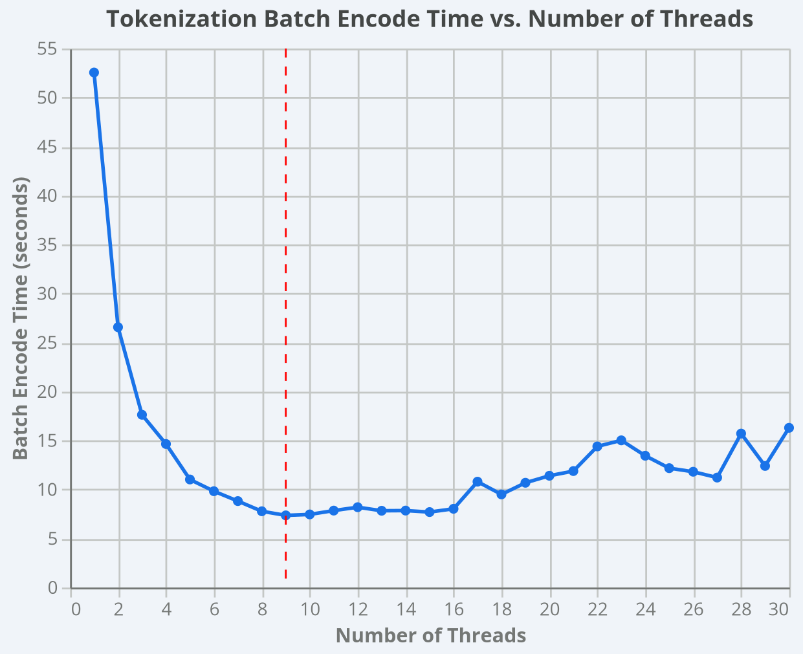

### tiktokenizer batch encode time v/s num_threads

This benchmark measures the time taken by `tiktoken`'s `encode_batch` for
different `num_threads` values on a 12 core machine. 

The goal was to just understand how does the tokenization time vary with num_threads.

```
for i in {1..30}; do
    python benchmarking/tokeniser_batch_encode.py --num_threads $i
done
```
#### Result plot



#### Result Analysis
[Gemini conversation](https://gemini.google.com/share/a767b4b6c658) to further understand this phenomina

- Tokenization time reduces near-linearly [i.e. approx matching T_single_thread/num_threads] as we initially increase num_threads > 1
- Pleataus around num_threads=8 as diminishing returns start to kick-in due to context switching overhead.
- For num_threads>=16, context switching overhead increases and a lot of time is spent in thread contention [i.e. pause one thread, save its state, load another thread and run]


#### Actual numbers

| n_threads | raw_data_load_time | tokenizer_batch_encode_time_in_seconds |
|-----------|--------------------|----------------------------------------|
| 1         | 0.4322             | 52.5508                                |
| 2         | 0.5386             | 26.5676                                |
| 3         | 0.5085             | 17.6309                                |
| 4         | 0.55               | 14.6522                                |
| 5         | 0.4972             | 11.0302                                |
| 6         | 0.4777             | 9.8341                                 |
| 7         | 0.494              | 8.8259                                 |
| 8         | 0.5152             | 7.7873                                 |
| 9         | 0.5119             | 7.367                                  |
| 10        | 0.5085             | 7.4656                                 |
| 11        | 0.5183             | 7.8553                                 |
| 12        | 0.5131             | 8.2025                                 |
| 13        | 0.5274             | 7.8393                                 |
| 14        | 0.5216             | 7.8567                                 |
| 15        | 0.5126             | 7.7051                                 |
| 16        | 0.5081             | 8.04                                   |
| 17        | 0.5155             | 10.8049                                |
| 18        | 0.528              | 9.507                                  |
| 19        | 0.5085             | 10.695                                 |
| 20        | 0.5115             | 11.4107                                |
| 21        | 0.5155             | 11.8891                                |
| 22        | 0.5481             | 14.4034                                |
| 23        | 0.5516             | 15.0238                                |
| 24        | 0.5264             | 13.4533                                |
| 25        | 0.4961             | 12.1849                                |
| 26        | 0.5096             | 11.8204                                |
| 27        | 0.5189             | 11.2252                                |
| 28        | 0.4994             | 15.714                                 |
| 29        | 0.4914             | 12.4115                                |
| 30        | 0.5282             | 16.3009                                |

Based on this benchmark, `num_threads=8` to `num_threads=10` is the best choice for this workload on the tested 12-core system.
